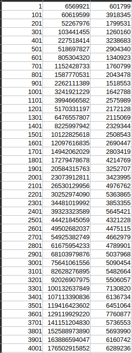
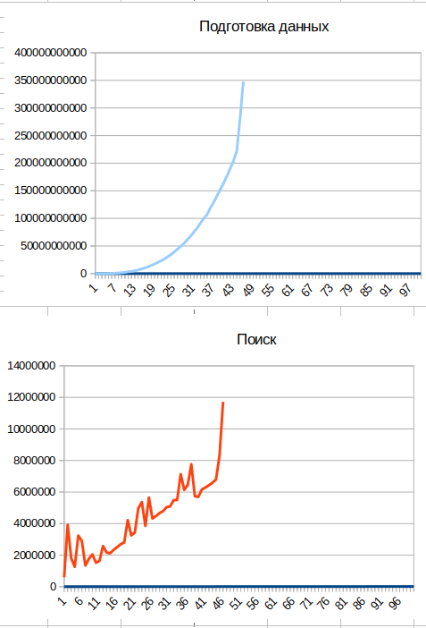
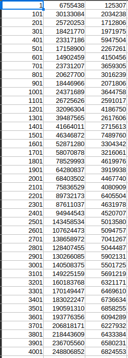
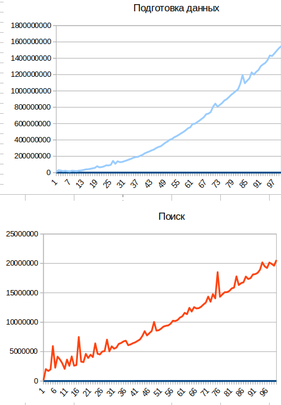
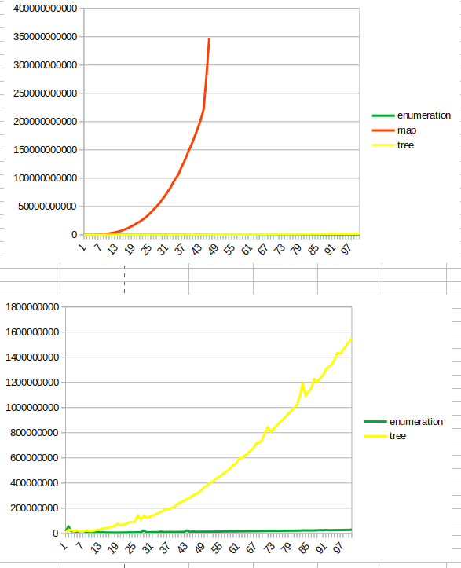
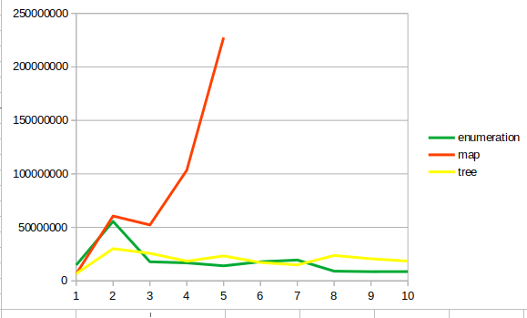
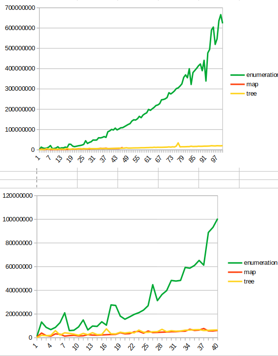
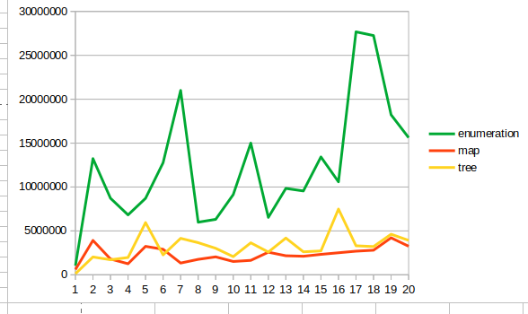

# ЛАБАРАТОРНАЯ РАБОТА №2 ХОЛЕВ АРТЕМ 22ПИ2

## Алгоритм перебора
Подготовка O(1), поиск O(n)

Суть алгоритма заключается в записи прямоугольников и после поступленя координат точек, запускается обычный перебор, с проверкой условия, что точка входит область прямоугольника

После запуска алгоритма были полученны данные:

Первый столбец: кол-во точек и прямоугольников  
Второй столбец: время подготовки данных  
Третий столбец: время поиска ответа

В подготовку данных входит запись крайных точек в массив.

## Алгоритм на карте
Подготовка O(n^3), поиск O(log(n))

Построение карты по сжатым координатам и нахождение количества пересекающихся прямоугольников в точке с помощью бинарного поиска. Поступающие точки прямоугольников сжимаются и записываются в матрице. При полученни точки поиска, x и y сжимаются, используя алгоритм бинарного поиска и извлекаются данне из матрицы по сжатым координатам.

В ходе выполнения алгоритма были получены следующие данные:

Визуализация:

Из данных можно увидеть, что предпроцессинг занимает очень много времени - O(n^3), но при этом поиск точек пересечения находится достаточно быстро.

## Алгоритм на дереве
Подготовка O(n*log(n)), поиск O(log(n))

Суть алгоритма, построение персистентного дерева отрезков и последующий поиск значения в массиве деревьев по сжатым координатам точки. Построение дерева основано на принципе начала и конца прямоугольника. +1 - начало -1 -конец отрезка. Обход заключается в суммировании модификаторов, на заданном диапазоне.

# Итоги
Объеденяя выше показанные графики, были получены следующие данные

## Построение

Сразу же видно как возрастает время подготовки данных для алгоритма map. Но по линии enumeration и tree видно, что на больших данных разница не заметна, но если взять не большой отрезок, то по скорости подготовки даннх обычный алгоритм занимает меньше времени.

Немного детальнее для 3 алгоритмов

## Запросы

 

По запросам видно, что обычный перебор занимает больше времени, чем алгорим map и tree. 

Алгоитмы на основании map и tree в среднем одинаковы.

## Выводы
Стоит обратить внимание на то, что самое быстрое построение происходило у обычного перебора O(1). В двух других случаях выполнялось за O(n^3) и O(n*logn) сложности для построения карты и дерева. Алгоритм на карте имеет плохую асимптотическую сложность, очень медленно работает на больших данных.

Если говорить про запросы обычный алгоритм перебора, работает дольше чем алгоритмы, построенные на основе карты и дерева. В среднем алгоритм построенный на основе карты и дерева работают одинаково при запросе.